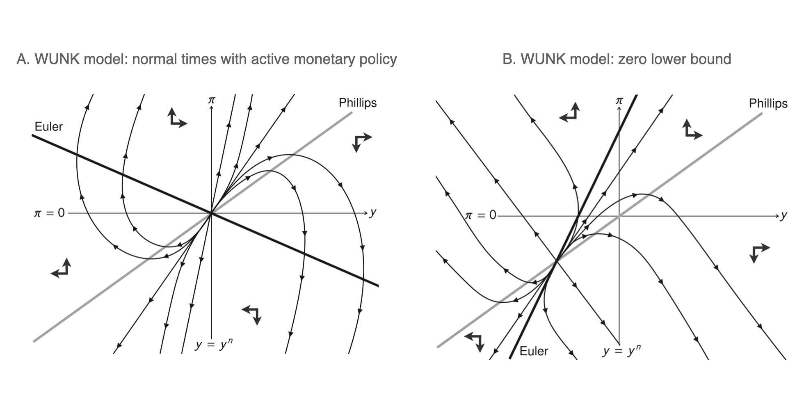

<!-- ---

##### Download

+ [Paper](paper2.pdf)
+ [Online appendix](appendix2.pdf)
+ [Code and data](https://github.com/pmichaillat/unemployment-gap) -->

---

##### Abstract

A chief goal of artificial intelligence is to build machines that think like people. Yet it has been argued that deep neural network architectures fail to accomplish this. Researchers have asserted these models' limitations in the domains of causal reasoning, intuitive physics, and intuitive psychology. Yet recent advancements, namely the rise of large language models, particularly those designed for visual processing, have rekindled interest in the potential to emulate human-like cognitive abilities. This paper evaluates the current state of vision-based large language models in the domains of intuitive physics, causal reasoning, and intuitive psychology. Through a series of controlled experiments, we investigate the extent to which these modern models grasp complex physical interactions, causal relationships, and intuitive understanding of others' preferences. Our findings reveal that, while these models demonstrate a notable proficiency in processing and interpreting visual data, they still fall short of human capabilities in these areas. The models exhibit a rudimentary understanding of physical laws and causal relationships, but their performance is hindered by a lack of deeper insights-a key aspect of human cognition. Furthermore, in tasks requiring an intuitive theory of mind, the models fail altogether. Our results emphasize the need for integrating more robust mechanisms for understanding causality, physical dynamics, and social cognition into modern-day, vision-based language models, and point out the importance of cognitively-inspired benchmarks.

<!-- --- -->

<!-- ##### Figure X: Figure caption

 -->

---

##### Citation

<!-- Author 1 and Author 2. Year. "Title." *Journal* Volume (Issue): First page–Last page. https://doi.org/paper_doi. -->

```BibTeX
@misc{buschoff2024visual,
      title={Visual cognition in multimodal large language models}, 
      author={Luca M. Schulze Buschoff and Elif Akata and Matthias Bethge and Eric Schulz},
      year={2024},
      eprint={2311.16093},
      archivePrefix={arXiv},
      primaryClass={cs.LG}
}
```

---

<!-- ##### Related material

+ [Presentation slides](presentation2.pdf) -->

